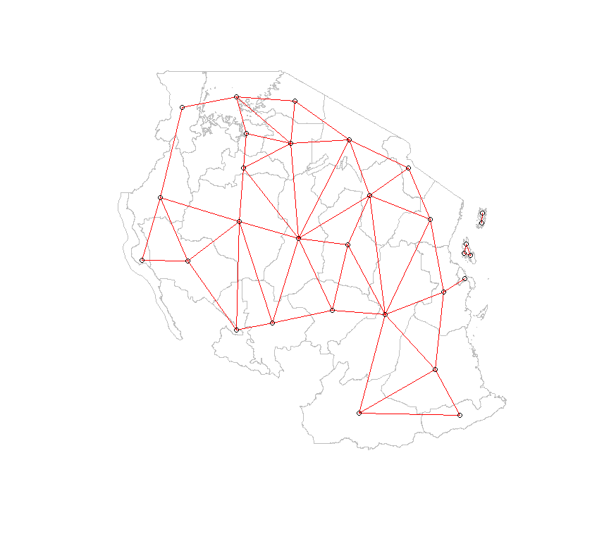

# 📍 Spatial Epidemiology & Hotspot Detection: Malaria in Tanzania

## 📋 Executive Summary
This project identifies statistically significant geographic clusters of malaria in Tanzania using **Local Indicators of Spatial Association (LISA)**. By analyzing over 4,400 survey points, this study provides a data-driven framework for targeted public health interventions.

---

## 🔬 Core Analysis & Visualizations

### 1. Spatial Topology & Connectivity
Before statistical inference, I constructed a **Queen Contiguity** weights matrix to define regional neighbors. This network (visualized below) is the foundation for calculating spatial autocorrelation.




### 2. Sub-national Hotspot Identification
The final analysis utilizes **Local Moran’s I** to distinguish between random noise and statistically significant clusters ($p \le 0.05$). 


**Key Finding:** A significant **High-High (Hotspot)** cluster was identified in the Southern regions, indicating a geographic area where high prevalence is spatially persistent.

---

## 🛠️ Technical Workflow
1. **Data Sourcing:** Automated API retrieval via `malariaAtlas`.
2. **Preprocessing:** Coordinate auditing and spatial joins using the `sf` package.
3. **Statistical Modeling:** Global and Local Moran's I tests conducted in `spdep`.
4. **Visualization:** Multi-scale mapping with `ggplot2`.

---

## 🚀 How to Reproduce
```R
# Clone the repo and run the main script
source("scripts/malaria_spatial_analysis.R")
